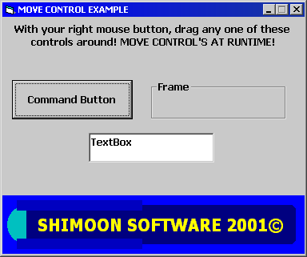



## Move control's at runtime\!

### Description

Really great code for MOVING CONTROLS AT RUNTIME. This means that the client can customize the interface of your program at runtime. Really nice touch to your program. If you like it and think it is useful, vote for it, if not, email me at a_shimoon@hotmail.com and give me some constructive critisism! Thank you =)

Armen Shimoon
 
### More Info
 

             |
---                |---
**Submitted On**   |2001-05-10 16:17:24
**By**             |[Armen Shimoon](https://github.com/Planet-Source-Code/PSCIndex/blob/master/ByAuthor/armen-shimoon.md)
**Level**          |Beginner
**User Rating**    |5.0 (15 globes from 3 users)
**Compatibility**  |VB 6\.0
**Category**       |[Miscellaneous](https://github.com/Planet-Source-Code/PSCIndex/blob/master/ByCategory/miscellaneous__1-1.md)
**World**          |[Visual Basic](https://github.com/Planet-Source-Code/PSCIndex/blob/master/ByWorld/visual-basic.md)
**Archive File**   |[Move contr194825102001\.zip](https://github.com/Planet-Source-Code/armen-shimoon-move-control-s-at-runtime__1-23099/archive/master.zip)

